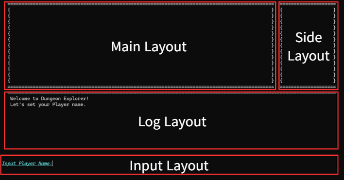

#  Dungeon Explorer

C++로 구현한 콘솔 기반 던전 탐험 RPG입니다.
플레이어가 스테이지를 진행하며 전투, 아이템 사용, 이벤트를 경험하는 게임입니다.

## 프로젝트 소개
- 개발 기간: 2026.03.26 ~ 2026.04.01
- 팀원 수: 6명

## 주요 기능
- 스테이지 진행
- 전투 시스템
- 아이템 및 인벤토리
- 상점 시스템
- 몬스터 및 보스전
- 캐릭터 및 직업 시스템
- 로그 시스템
- Sprite 및 애니메이션 출력

## 개발 환경
- Language: C++
- Platform: Console

## 실행 방법
1. 프로젝트를 빌드합니다.
2. 실행파일을 실행합니다.
3. 콘솔 창에서 안내에 따라 입력을 진행합니다.

## 클래스 / 시스템 설명
- **GameFlowManager**: 게임의 전체 진행 순서를 제어합니다.
- **GameManager**: 플레이어와 인벤토리를 관리합니다.
- **BattleSystem**: 플레이어와 몬스터 간 전투를 처리합니다.
- **StageManager**: 스테이지 변경/진입 이벤트와 랜덤 이벤트 실행을 담당합니다
- **Stage**: 각기 다른 진입 이벤트와 랜덤 이벤트를 보유하고 있습니다.
- **Item, Inventory**: 아이템 획득, 착용, 보관을 담당합니다.
- **Store**: 아이템 구매, 판매를 담당합니다.
- **Monster, Boss**: 범위 내 랜덤으로 스텟을 가진 몬스터와 보스를 생성, 관리합니다. 
- **Character, Job**: 캐릭터 정보를 관리하며, 직업 별로 서로 다른 능력치 가중치를 적용합니다.
- **Log System**: 게임 내 이벤트 및 시스템 메시지를 출력합니다.
- **Sprite, Animation**: 전투 시 몬스터 스프라이트와 몬스터 피격, 몬스터 공격 애니메이션을 표현합니다.

## 역할 분담
* 김재성
    * 로그 시스템
    * Sprite 및 애니메이션
* 이건이
    * 게임 진행 흐름
    * 게임 매니저
* 박광훈
    * 아이템
    * 인벤토리
    * 상점
* 김대현
    * 몬스터
    * 보스 
* 조범근
    * 전투 시스템
    * 스테이지
* 고예현
    * 캐릭터
    * 직업

## 협업 방식
각 기능을 분담하여 각자의 브랜치에서 작업하고, 이를 하나의 프로젝트로 통합하는 방식으로 협업하였습니다.

## 트러블 슈팅

## 화면 구성

* Main Layout: 전반적인 콘텐츠를 보여주는 공간 
* Side Layout: 플레이어 상태 창을 보여주는 공간
* Log Layout: 이벤트, 시스템 메시지를 보여주는 공간
* Input Layout: 사용자의 입력을 받는 공간

## 시연 영상

* [Youtube 링크](https://www.youtube.com/watch?v=GuemXqiNJm0)